  <a href="https://git.io/typing-svg" target="_blank" rel="noopener noreferrer">
     
    
  </a>

Welcome to my GitHub profile! I'm <b>Malaika Tariq</b>, a Full-Stack Developer and Software Engineering student passionate about transforming ideas into responsive, functional and visually engaging web applications. I work across frontend, backend and databases to build complete digital experiences that are practical, accessible and enjoyable to use.

 

  

 

<h2 align="left">👩‍💻 About Me</h2>

  
💻 Building modern full-stack web applications

  
⚛️ Creating responsive interfaces with React

  
⚙️ Developing backend services and APIs

  
🗄️ Working with relational and NoSQL databases

  
🌱 Strengthening my MERN Stack expertise

  
🤝 Open to internships and collaborations

   
  &nbsp;
  &nbsp;
  

<h2 align="center">My Tech Stack&nbsp;&nbsp;</h2>

<table align="center">
  <tr>
    <td align="center" width="96"> <b>React</b></td>
    <td align="center" width="96"> <b>JavaScript</b></td>
    <td align="center" width="96"> <b>TypeScript</b></td>
    <td align="center" width="96"> <b>Python</b></td>
    <td align="center" width="96"> <b>HTML5</b></td>
    <td align="center" width="96"> <b>CSS3</b></td>
    <td align="center" width="96"> <b>Java</b></td>
    <td align="center" width="96"> <b>PHP</b></td>
  </tr>
  <tr>
    <td align="center" width="96"> <b>Node.js</b></td>
    <td align="center" width="96"> <b>Express</b></td>
    <td align="center" width="96"> <b>MongoDB</b></td>
    <td align="center" width="96"> <b>MySQL</b></td>
    <td align="center" width="96"> <b>Firebase</b></td>
    <td align="center" width="96"> <b>Flask</b></td>
    <td align="center" width="96"> <b>Tailwind</b></td>
    <td align="center" width="96"> <b>Bootstrap</b></td>
  </tr>
  <tr>
    <td align="center" width="96"> <b>GitHub</b></td>
    <td align="center" width="96"> <b>Git</b></td>
    <td align="center" width="96"> <b>VS Code</b></td>
    <td align="center" width="96"> <b>Postman</b></td>
    <td align="center" width="96"> <b>Power BI</b></td>
    <td align="center" width="96"> <b>Vite</b></td>
    <td align="center" width="96"> <b>Vercel</b></td>
    <td align="center" width="96"> <b>Oracle</b></td>
  </tr>
  <tr>
    <td align="center" width="96"> <b>XAMPP</b></td>
    <td align="center" width="96"> <b>Figma</b></td>
    <td align="center" width="96"> <b>Canva</b></td>
    <td align="center" width="96"> <b>Photoshop</b></td>
    <td align="center" width="96"> <b>Illustrator</b></td>
    <td align="center" width="96"> <b>npm</b></td>
    <td align="center" width="96"> <b>SQL</b></td>
    <td align="center" width="96"> <b>Jupyter</b></td>
  </tr>
</table>

  

<h2 align="center">Connect with Me!&nbsp;&nbsp;</h2>

  &nbsp;
  &nbsp;
  &nbsp;
  &nbsp;
  &nbsp;
  &nbsp;
  &nbsp;
  

<!-- Discord profile links require a numeric user ID: https://discord.com/users/YOUR_DISCORD_USER_ID -->

  

<h2 align="center">Development Metrics&nbsp;&nbsp;</h2>

<table align="center">
  <tr>
    <td align="center" width="50%">
      
    </td>
    <td align="center" width="50%">
      
    </td>
  </tr>
</table>

  

<h2 align="center">My Stats&nbsp;&nbsp;</h2>

  

<h2 align="center">GitHub Graph&nbsp;&nbsp;</h2>

  

